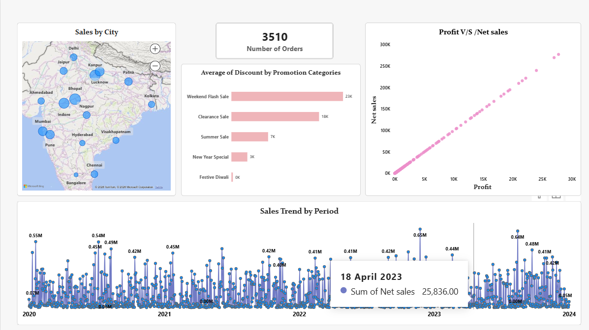
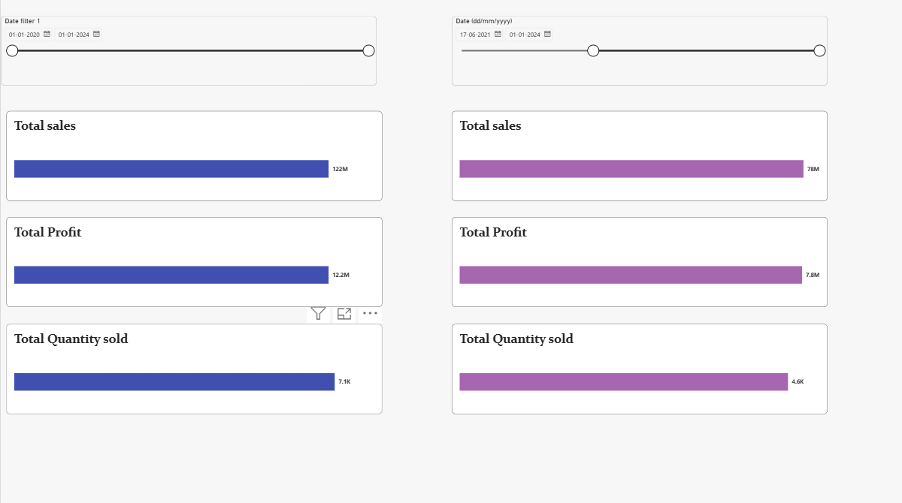

# ElectroHub Sales Analytics Dashboard – Power BI

## 📊 Project Overview

This project is a Sales Analytics Dashboard created using Microsoft Power BI.

The dashboard analyzes ElectroHub sales data to understand sales performance, product performance, sales trends, profit, discounts, and city-wise sales.

## 🎯 Project Objectives

- Analyze overall sales performance
- Identify top-performing products
- Analyze sales trends over time
- Understand profit and discount patterns
- Compare sales performance across different cities
- Create interactive and easy-to-understand dashboards

## 🛠️ Tools & Technologies

- Microsoft Power BI
- Microsoft Excel
- Power Query
- DAX
- Data Visualization

## 📈 Dashboard Pages

### 1. Sales Overview

Provides an overall view of sales performance using key sales metrics and visualizations.

### 2. Top&Bottom_Product-Analysis

Analyzes product-level performance and helps identify products contributing to sales.

### 3. comparison sales,Profit&Quantity

Shows sales patterns and trends over time.

### 4.Period-Comparison

Analyzes profit and discount patterns to understand their impact on sales performance.

### 5.Table Visual

Provides a city-wise analysis of sales performance.

## 📂 Project Structure

ElectroHub-Sales-Analytics-PowerBI
│
├── ElectroHub_Sales_Analytics.pbix
├── README.md
│
├── Dashboard-Screenshots
│   ├── 01-Sales-Overview.png
│   ├── 02-Product-Analysis.png
│   ├── 03-Sales-Trends.png
│   ├── 04-Profit-Discount-Analysis.png
│   └── 05-City-Analysis.png
│
└── Dataset
    └── sales_data.xlsx

📊 Dataset

The project uses an Excel dataset containing sales-related information.

Dataset file:

Dataset/sales_data.xlsx

🚀 How to Use
Download or clone this repository.
Open ElectroHub_Sales_Analytics.pbix using Microsoft Power BI Desktop.
If required, update the dataset path in Power BI.
Explore the different dashboard pages using filters and visualizations.

👩‍💻 Author

Manisha Choudhary
B.Tech CE Student | Aspiring Data Analyst

⭐ Project Purpose

This project demonstrates practical learning in Power BI, data visualization, data analysis, Power Query, and DAX. 
